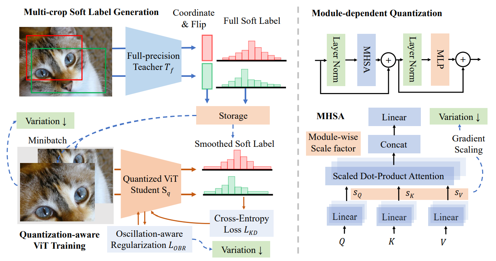

# VVTQ
Official PyTorch implementation of paper "Variation-aware Vision Transformer Quantization"

## Abstract

To address the heavy computation and parameter drawbacks, quantization is frequently studied in the community as a representative model compression technique and has seen extensive use on CNNs. However, due to the unique properties of CNNs and ViTs, the quantization applications on ViTs are still limited and
underexplored. In this paper, we identify the difficulty of ViT quantization on its unique **variation** behaviors, which differ from traditional CNN architectures. The variations indicate the magnitude of the parameter fluctuations and can also measure outlier conditions. Moreover, the variation behaviors reflect the various sensitivities to the quantization of each module. The quantization sensitivity analysis and comparison of ViTs with CNNs help us locate the underlying differences in variations. We also find that the variations in ViTs
cause training oscillations, bringing instability during quantization-aware training (QAT).

We solve the variation problem with an efficient knowledge-distillation-based variation-aware quantization method. The multi-crop knowledge distillation scheme can accelerate and stabilize the training and alleviate the variation’s influence during QAT. We also proposed a module-dependent quantization scheme and a variation-aware regularization term to suppress the oscillation of weights. On ImageNet-1K, we obtain a **77.66%** Top-1 accuracy on the low-bit scenario of 2-bit Swin-T, outperforming the previous state-of-the-art quantized model by **3.35%**. 

## Citation

	@article{huang2023variation,
	      title={Variation-aware Vision Transformer Quantization}, 
	      author={Xijie Huang, Zhiqiang Shen and Kwang-Ting Cheng},
	      year={2023},
	      journal={arXiv preprint arXiv:}
	}

 
