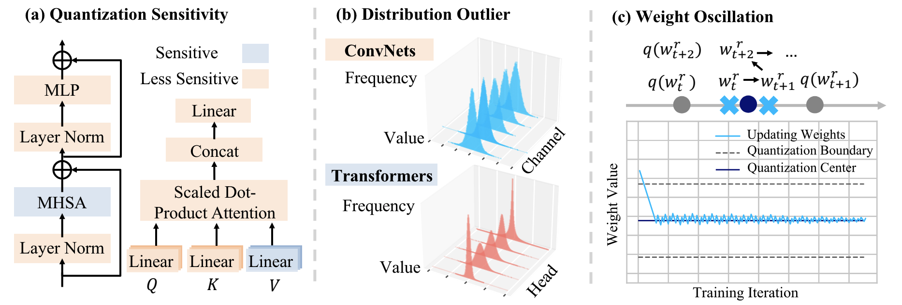

# Quantization Variation
Official PyTorch implementation of the anonymous ACM MM Submission "Quantization Variation: A New Perspective on Training Transformers with Low-Bit Precision" 

<div align=center>

</div>


## Preparation

### Requirements

- PyTorch 1.7.0+ and torchvision 0.8.1+ and pytorch-image-models 0.3.2
```shell
conda install -c pytorch pytorch torchvision
pip install timm==0.3.2
```

### Data and Soft Label

- Install PyTorch and ImageNet dataset following the [official PyTorch ImageNet training code](https://github.com/pytorch/examples/tree/master/imagenet). 

- Download the soft label following [FKD](https://github.com/szq0214/FKD) and unzip it. We provide multiple types of [soft labels](http://zhiqiangshen.com/projects/FKD/index.html), and we recommend to use [Marginal Smoothing Top-5 (500-crop)](https://drive.google.com/file/d/14leI6xGfnyxHPsBxo0PpCmOq71gWt008/view?usp=sharing). 

## Run

### Preparing for full-precision baseline model

- Download full-precision pre-trained weights via link provided in [Models](#models).
- (Optional) Train your own full-precision baseline model, please check `./fp_pretrained`.

### Quantization-aware training


- W4A4 DeiT-T Quantization with multi-processing distributed training on a single node with multiple GPUs:

```
CUDA_VISIBLE_DEVICES=0,1,2,3 python train_VVTQ.py \
--dist-url 'tcp://127.0.0.1:10001' \
--dist-backend 'nccl' \
--multiprocessing-distributed --world-size 1 --rank 0 \
--model deit_tiny_patch16_224_quant --batch-size 512 --lr 5e-4 \
--warmup-epochs 0 --min-lr 0 --wbits 4 --abits 4 --reg \
--softlabel_path ./FKD_soft_label_500_crops_marginal_smoothing_k_5 \
--finetune [path to full precision baseline model] \
--save_checkpoint_path ./DeiT-T-4bit --log ./log/DeiT-T-4bit.log\
--data [imagenet-folder with train and val folders]
```

### Evaluation
```
CUDA_VISIBLE_DEVICES=0 python train_VVTQ.py \
--model deit_tiny_patch16_224_quant --batch-size 512 --wbits 4 --abits 4 \
--resume [path to W4A4 DeiT-T ckpt] --evaluate --log ./log/DeiT-T-W4A4.log \
--data [imagenet-folder with train and val folders]
```

## Models

| Model    | W bits | A bits | accuracy (Top-1) |weights  |logs |
|:-------:|:--------:|:--------:|:--------:|:--------:|:--------:|
| `DeiT-T` | 32 | 32|   73.75    |[link](https://hkustconnect-my.sharepoint.com/:f:/g/personal/xhuangbs_connect_ust_hk/EoJbm6qBXoRNpOZbvv-Z4u0BSKji09RPWfFhSVjZ4Swmag?e=M3vf0h) |  - |
| `DeiT-T` | 4  | 4 | **74.71**  |[link](https://hkustconnect-my.sharepoint.com/:f:/g/personal/xhuangbs_connect_ust_hk/EmsOhPWW83tIqeB8_bHoJwkBHQIlgFyDs45WvQtBdZ80iA?e=zjSkXC)  |  [link](./log/DeiT-T-W4A4.log) |
| `DeiT-T` | 3  | 3 | **71.22**  |[link](https://hkustconnect-my.sharepoint.com/:f:/g/personal/xhuangbs_connect_ust_hk/El-PoCPkBLxJoIt1q5QAZPsBR6r03LtD6GT0E_JsEOa8UQ?e=jFaRmR)  |  [link](./log/DeiT-T-W3A3.log) |
| `DeiT-T` | 2  | 2 | **59.73**  |[link](https://hkustconnect-my.sharepoint.com/:f:/g/personal/xhuangbs_connect_ust_hk/EsFXkkBx5o5MmLmnOOBF5kgBrMvski1KK-tHhXG9pZdZOQ?e=2HCrSb)  |  [link](./log/DeiT-T-W2A2.log) |
| | | | | | |
| `SReT-T` | 32 | 32|   75.81    |[link](https://hkustconnect-my.sharepoint.com/:f:/g/personal/xhuangbs_connect_ust_hk/EulNclRNYmtGiYOhn9KEGGIBZ90gNN_k6SQLhrzSP2UArA?e=0Tzhxx) |  - |
| `SReT-T` | 4  | 4 | **76.99**  |[link](https://hkustconnect-my.sharepoint.com/:f:/g/personal/xhuangbs_connect_ust_hk/EonJNVBF7E1EoLvFvg3ZZmwBhMedIfGzXApLOxn2mk5HyQ?e=rTrtki)  |  [link](./log/SReT-T-W4A4.log) |
| `SReT-T` | 3  | 3 | **75.40**  |[link](https://hkustconnect-my.sharepoint.com/:f:/g/personal/xhuangbs_connect_ust_hk/EjCW5BP4uI9EjcP3XxVb3cEBLUTpeEV4puhjnEKWkihY-A?e=KpdFOg)  |  [link](./log/SReT-T-W3A3.log) |
| `SReT-T` | 2  | 2 | **67.53**  |[link](https://hkustconnect-my.sharepoint.com/:f:/g/personal/xhuangbs_connect_ust_hk/Enp9pzS2Es1Oh0wuDZTVYTAB-PX4K8-cX58syW36muboPA?e=vhCa1H)  |  [link](./log/SReT-T-W2A2.log) |
| | | | | | |
| `Swin-T` | 32 | 32|    81.0    |[link](https://hkustconnect-my.sharepoint.com/:f:/g/personal/xhuangbs_connect_ust_hk/Er1hvDL6lNNBjlJbiBDNZ3UB-liw32fjCZbUYodDLbYcDg?e=MAIMt8) |  - |
| `Swin-T` | 4  | 4 | **82.42**  |[link](https://hkustconnect-my.sharepoint.com/:f:/g/personal/xhuangbs_connect_ust_hk/EkKkcCGrejJHl8ENdydFk_EBashaw8UHbO9UhLcWSL9img?e=91aNWe)  |  [link](./log/Swin-T-W4A4.log) |
| `Swin-T` | 3  | 3 | **81.37**  |[link](https://hkustconnect-my.sharepoint.com/:f:/g/personal/xhuangbs_connect_ust_hk/EtfaRgHlLuxNss6w42yHf2kBTkIyskg9rsRlPvBlOsS1Pg?e=tGDdCB)  |  [link](./log/Swin-T-W3A3.log) |
| `Swin-T` | 2  | 2 | **77.66**  |[link](https://hkustconnect-my.sharepoint.com/:f:/g/personal/xhuangbs_connect_ust_hk/Eud-4deIkJ9Dvrls0GWES1IBhl9Ej2bBfUy-7wPA3cf1xQ?e=BoyWB4)  |  [link](./log/Swin-T-W2A2.log) |


